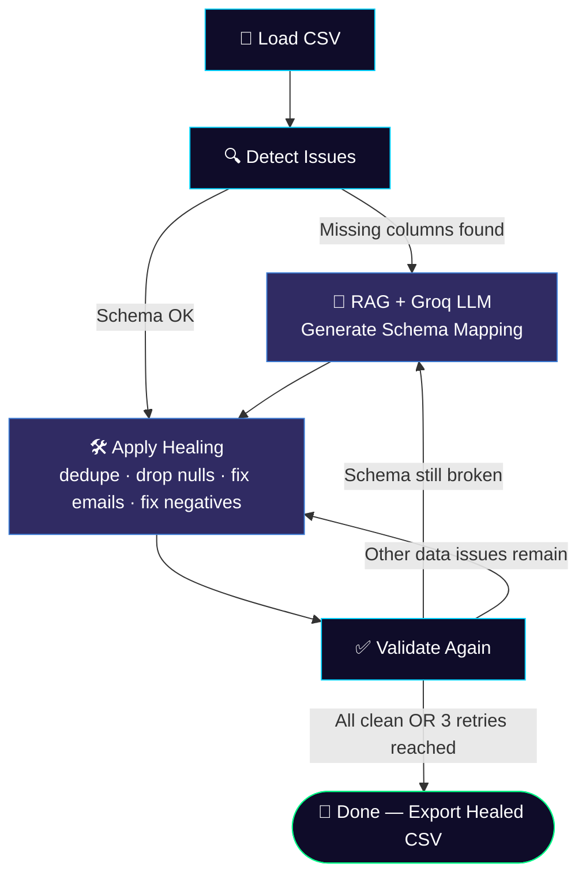

<div align="center">

# 🩺 Self-Healing Data Pipeline

### AI-Powered CSV Data Quality & Schema Auto-Repair using **LangGraph**, **RAG** & **Groq LLM**

Stop writing brittle ETL scripts. Upload *any* messy CSV — even with wrong column names — and watch the pipeline **detect, reason about, and heal itself** in real time.

[](https://www.python.org/)
[](https://streamlit.io/)
[](https://www.langchain.com/langgraph)
[](https://groq.com/)
[](https://github.com/facebookresearch/faiss)
[](LICENSE)

<br/>

**🔥 Self-healing data quality • 🧠 RAG-grounded schema mapping • ⚡ Groq-speed LLM inference • 🎨 Beautiful dark-mode dashboard**

</div>

---

## 📖 Table of Contents

- [Why This Project?](#-why-this-project)
- [Key Features](#-key-features)
- [How It Works](#-how-it-works)
- [Tech Stack](#-tech-stack)
- [Project Structure](#-project-structure)
- [Getting Started](#-getting-started)
- [Configuration](#-configuration)
- [Usage](#-usage)
- [Example Walkthrough](#-example-walkthrough)
- [Roadmap](#-roadmap)
- [Contributing](#-contributing)
- [License](#-license)
- [Author](#-author)

---

## 🚀 Why This Project?

Real-world CSVs are messy. Columns get renamed by upstream teams, emails get malformed, amounts go negative due to refunds, and duplicate rows sneak in from retries. Traditional pipelines **crash** or silently corrupt data when this happens.

**Self-Healing Data Pipeline** treats data quality like a doctor treats a patient:

1. 🩻 **Diagnose** — scan the incoming file for schema drift, nulls, duplicates, bad emails, and negative values.
2. 🧠 **Reason** — if the schema doesn't match, retrieve your company's data rules (RAG over `company_rules.txt`) and ask a Groq-hosted LLM to intelligently map the *wrong* column names to the *correct* ones — no hardcoded `if/else` renaming logic required.
3. 💉 **Heal** — automatically clean the data: rename columns, drop duplicates, fix invalid emails, neutralize negative values.
4. 🔁 **Re-validate** — loop the diagnosis → healing cycle (up to 3 retries) via a **LangGraph** state machine until the data is production-ready — or safely bail out.

The result: a CSV your database will actually accept, with a full audit trail of every action taken.

---

## ✨ Key Features

| Feature | Description |
|---|---|
| 🔍 **Automated Data Quality Scan** | Detects missing columns, null values, duplicate rows, invalid emails, and negative purchase amounts in one pass |
| 🧠 **RAG-Grounded Schema Healing** | Uses FAISS + HuggingFace embeddings to retrieve your company's column-mapping rules, then asks Groq's LLM to semantically map mismatched columns |
| ⚡ **Groq-Powered LLM Inference** | Runs on `llama-4-scout-17b-16e-instruct` via Groq for near-instant schema mapping |
| 🔁 **Self-Healing Loop (LangGraph)** | A stateful graph that keeps re-validating and re-healing data until it's clean or hits a retry limit — no manual re-runs |
| 🎨 **Stunning Dark-Mode UI** | Glassmorphism-styled Streamlit dashboard with animated metric cards, before/after comparisons, and a full healing-action log |
| 📥 **One-Click Export** | Download the fully healed, database-ready CSV directly from the browser |
| 🧩 **Pluggable Rules Engine** | Update `docs/company_rules.txt` to change healing behavior — no code changes needed |

---

## 🧠 How It Works

The pipeline is orchestrated as a **LangGraph** state machine. Each node represents one stage of diagnosis or healing, and conditional edges decide whether the data needs an LLM-powered schema fix, a simple cleanup pass, or is already good to go.



**Step by step:**

1. **`load_csv`** — reads the uploaded file into a Pandas DataFrame.
2. **`detect_issues`** — runs five checks: missing expected columns, null values, duplicate rows, invalid emails, negative amounts.
3. **`generate_mapping`** *(conditional)* — only triggers if columns don't match the expected schema. Retrieves relevant rules from a FAISS vector store built over your `company_rules.txt`, then prompts a Groq LLM to return a JSON column-rename mapping.
4. **`apply_healing`** — renames columns, drops duplicate/null rows, nullifies invalid emails, and zeroes out negative purchase amounts. Every action is logged.
5. **`validate_again`** — re-runs all checks on the healed data.
6. **Loop or finish** — if issues remain and retries < 3, the graph routes back to either schema mapping or healing; otherwise, it terminates and surfaces the final, cleaned dataset.

---

## 🛠 Tech Stack

| Layer | Technology |
|---|---|
| **Frontend / Dashboard** | [Streamlit](https://streamlit.io/) |
| **Orchestration** | [LangGraph](https://www.langchain.com/langgraph) (stateful agent graph) |
| **LLM Inference** | [Groq](https://groq.com/) — `llama-4-scout-17b-16e-instruct` |
| **RAG / Retrieval** | [LangChain](https://www.langchain.com/) + [FAISS](https://github.com/facebookresearch/faiss) |
| **Embeddings** | HuggingFace `all-MiniLM-L6-v2` (local, free, no API cost) |
| **Data Processing** | [Pandas](https://pandas.pydata.org/) |
| **Config** | `python-dotenv` |

---

## 📂 Project Structure

```
self-healing-data-pipeline/
│
├── app.py                  # Streamlit dashboard (UI layer)
├── graph.py                 # LangGraph state machine — orchestrates the healing pipeline
├── utils.py                  # Detection logic, RAG retriever, Groq LLM mapping, healing functions
├── docs/
│   └── company_rules.txt     # Your data governance rules (used for RAG-based schema mapping)
├── data/
│   └── healed_output.csv      # Auto-generated healed CSV (created at runtime)
├── .env                        # GROQ_API_KEY (you create this — see below)
└── README.md
```

---

## ⚙️ Getting Started

### Prerequisites

- Python **3.10+**
- A free [Groq API key](https://console.groq.com/keys)

### Installation

```bash
# 1. Clone the repository
git clone https://github.com/sarthakarsul18/self-healing-data-pipeline.git
cd self-healing-data-pipeline

# 2. Create a virtual environment
python -m venv venv
source venv/bin/activate      # On Windows: venv\Scripts\activate

# 3. Install dependencies
pip install streamlit pandas python-dotenv langchain-groq langchain-community \
            langchain-core langchain-text-splitters langchain-classic \
            langgraph faiss-cpu sentence-transformers
```

> 💡 Tip: Pin these into a `requirements.txt` for reproducible installs — happy to generate one if you need it.

### Environment Setup

Create a `.env` file in the project root:

```env
GROQ_API_KEY=your_groq_api_key_here
```

---

## 🧩 Configuration

The schema-healing intelligence is **rule-driven**, not hardcoded. Add or edit your organization's data standards in `docs/company_rules.txt` — for example:

```
The expected column for a unique order identifier is "transaction_id".
The expected column for a customer's email address is "customer_email".
The expected column for the order total is "purchase_amount".
The expected column for the order date is "purchase_date".
Column names from upstream vendors may use abbreviations, snake_case, or camelCase.
```

The pipeline retrieves the most relevant rules for the *current* mismatched columns and feeds them to the LLM — so your mapping logic evolves with your business, not with your code.

---

## ▶️ Usage

```bash
streamlit run app.py
```

Then in the browser:

1. 📂 Upload any CSV (even with wrong/garbled column names).
2. 🚀 Click **Launch Self-Healing**.
3. 👀 Watch the before/after issue cards update.
4. 🛠️ Review every healing action in the expandable log.
5. ⬇️ Download the production-ready `healed_data.csv`.

---

## 🎯 Example Walkthrough

**Input CSV** (messy, mismatched headers, dirty rows):

| order_id | email | amount | date |
|---|---|---|---|
| 101 | john@@mail | -50.00 | 2024-01-01 |
| 101 | john@@mail | -50.00 | 2024-01-01 |
| 102 | jane@mail.com | 75.00 |  |

**What the pipeline does:**

- 🧠 Maps `order_id → transaction_id`, `email → customer_email`, `amount → purchase_amount`, `date → purchase_date` using RAG + Groq.
- 🗑️ Drops the duplicate row.
- 🧹 Drops the row with a missing date.
- 📧 Removes the malformed `john@@mail` entry.
- 💰 Zeroes out the negative purchase amount.

**Output:** a clean, schema-correct CSV ready for your database — with a full action log explaining exactly what changed and why.

---

## 🗺 Roadmap

- [ ] Support for additional file formats (JSON, Excel)
- [ ] Configurable healing strategies (drop vs. impute vs. flag)
- [ ] Pluggable LLM providers (OpenAI, Anthropic, local models via Ollama)
- [ ] Batch processing for multiple files
- [ ] Exportable healing reports (PDF/HTML)
- [ ] Unit test suite for detection & healing functions

Have an idea? [Open an issue](../../issues) or submit a PR!

---

## 🤝 Contributing

Contributions are what make the open-source community amazing! Any contributions you make are **greatly appreciated**.

1. Fork the project
2. Create your feature branch (`git checkout -b feature/AmazingFeature`)
3. Commit your changes (`git commit -m 'Add some AmazingFeature'`)
4. Push to the branch (`git push origin feature/AmazingFeature`)
5. Open a Pull Request

Don't forget to ⭐ **star this repo** if you find it useful — it really helps the project gain visibility!

---

## 📄 License

Distributed under the **MIT License**. See [`LICENSE`](LICENSE) for more information.

---

## 👤 Author

**Built with ⚡ by Sarthak Arsul**

If this project helped you or inspired you, consider giving it a ⭐ on GitHub!

</div>
